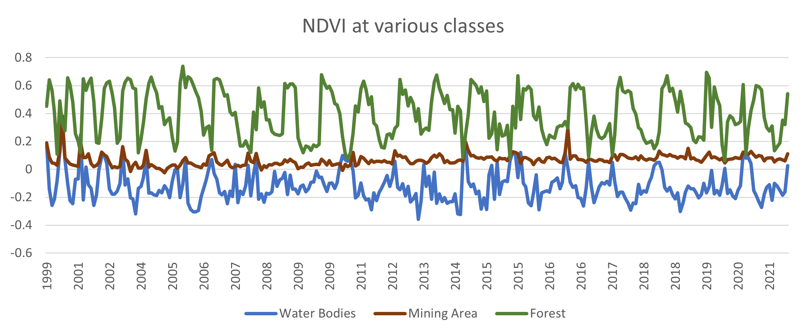
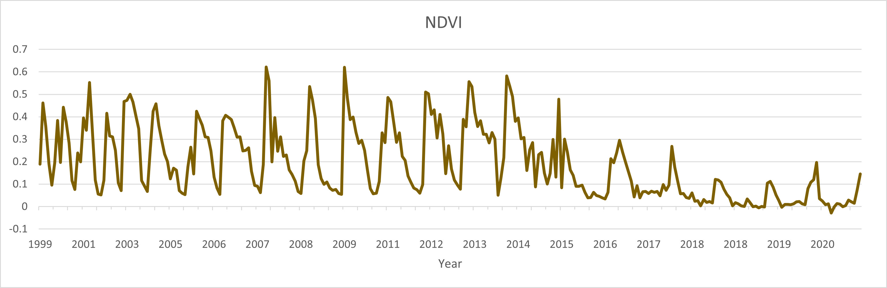
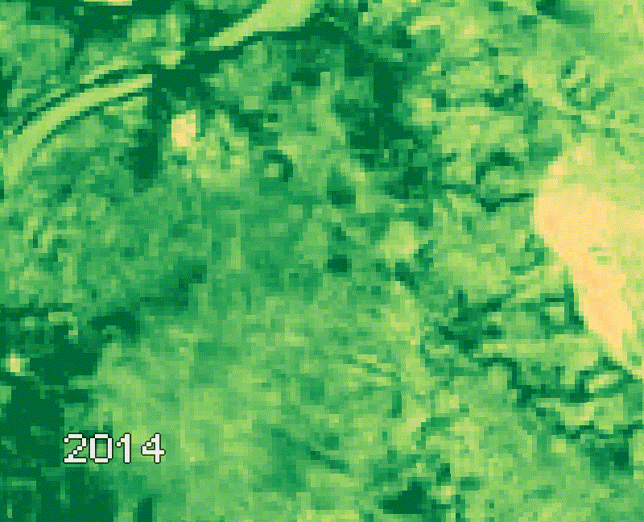
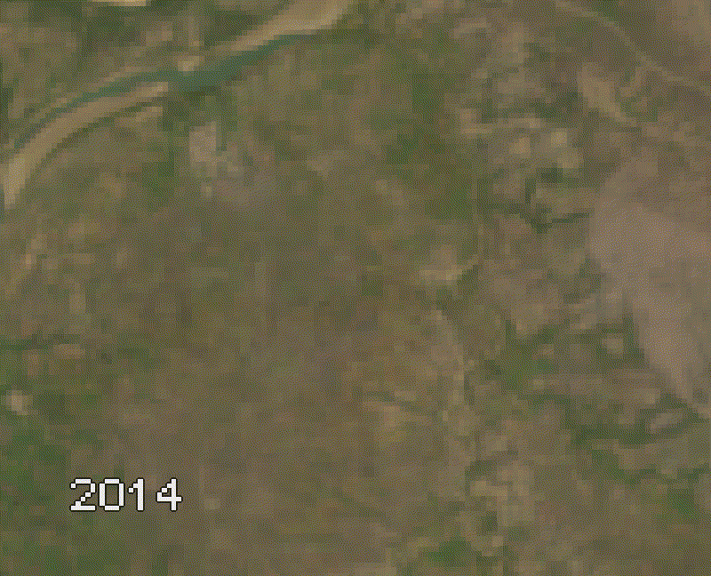

# Coal Mines Visualization
A visualization tool created on Google Earth engine (GEE) to help analyze the coal mining area and predict the period of mining operation.


## Installing
```bash
git clone https://github.com/saumyatas/Coal_Mines_Visualization.git
```

## Visulization Plots
With the help of the surrounding areas of the mining area a NDVI reference graph is created to distinguish forest and water bodies from the mining area.

### NDVI reference chart


With the help of change in NDVI we can predict that the period of operation for this mine started in early 2016 or late 2015.

### NDVI of the mining area


## Visulization GIFs

The expansion of mining area and change in operation can be visualized using Landsat series satellite data.

### Normalized Difference Built-up Index GIFs


### RGB Visualization GIFs


## Author
[Saumyata Srivastava](https://www.linkedin.com/in/ss-97b05a103/)

## License
This project is licensed under the MIT License - see the [LICENSE](LICENSE) file for details
